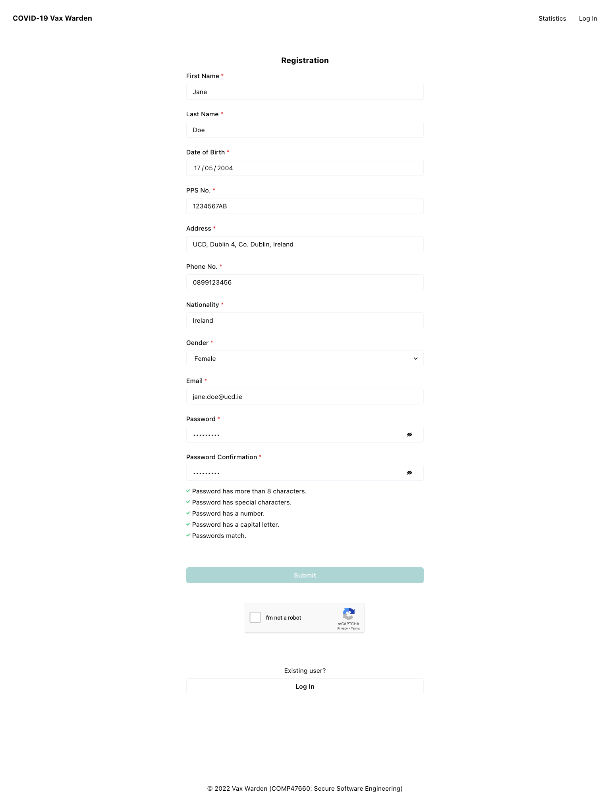
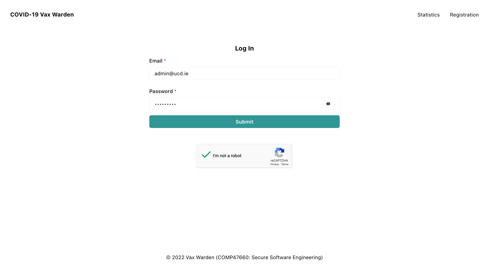
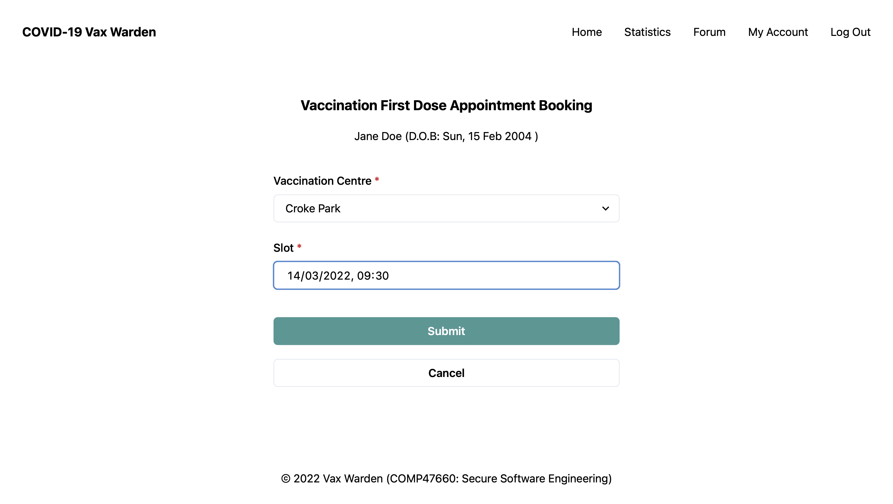

# Vax Warden

COVID-19 vaccine registration system using Java, Spring Boot and React.js, developed for COMP47660 Secure Software Engineering.

## Requirements

- Docker
- JDK >= 11
- [mkcert](https://github.com/FiloSottile/mkcert), make sure to run `mkcert -install` after installation
- [certutil](https://firefox-source-docs.mozilla.org/security/nss/legacy/tools/nss_tools_certutil/index.html) for Firefox support
- [openssl](https://github.com/openssl/openssl)
- **OS: macOS or Linux** (including Windows Subsystem for Linux 2). Native Windows does not support [tmpfs mounts](https://docs.docker.com/storage/tmpfs/) used to speed up the Docker container set-up. If running on Windows, the boot time will be greater, but it is possible to comment out the `tmpfs: - /var/lib/mysql` lines in [docker-compose.yml](./docker-compose.yml), and also change the sleep time from 5 to 35 seconds in [backend/Dockerfile](./backend/Dockerfile).

> 
## Getting Started

- Running with `docker-compose`. The `--clean` flag is optional (for a `mvn clean install`).

  ```bash
  ./run-services.sh --clean
  ```

- Navigate to [localhost](https://localhost/) in a browser to view the frontend after the Spring Boot application is running (check `docker-compose` logs). _Note_: If unable to access localhost, find the container IP address as shown below and navigate to `https://<IP>` instead.

  ```bash
  docker inspect -f '{{range .NetworkSettings.Networks}}{{.IPAddress}}{{end}}' vax-warden-frontend
  ```

- Admin account credentials for testing: `admin@ucd.ie:Admin!234`.

- For local testing of the backend API, run HTTP requests under `src/main/resources/http/`. _Note_: An `Authorization: Bearer <token>` must be added using the JWT token obtained after logging in as a user.

## User Interface

#### Registration, Login, Logout





#### Home, Vaccination Booking, My Account





#### Admin


#### Statistics


#### Forum


## Authors

- [Chee Guan Tee](https://www.jasontcg.com)
- [Conor Knowles](https://conorknowles.com)
- [Rajit Banerjee](https://rajitbanerjee.com)

See [CONTRIBUTIONS.md](./CONTRIBUTIONS.md), [Pull Requests](https://github.com/rajitbanerjee/vax-warden/pulls?q=is%3Apr+is%3Aclosed) and [Kanban](https://github.com/rajitbanerjee/vax-warden/projects/1) for more.
